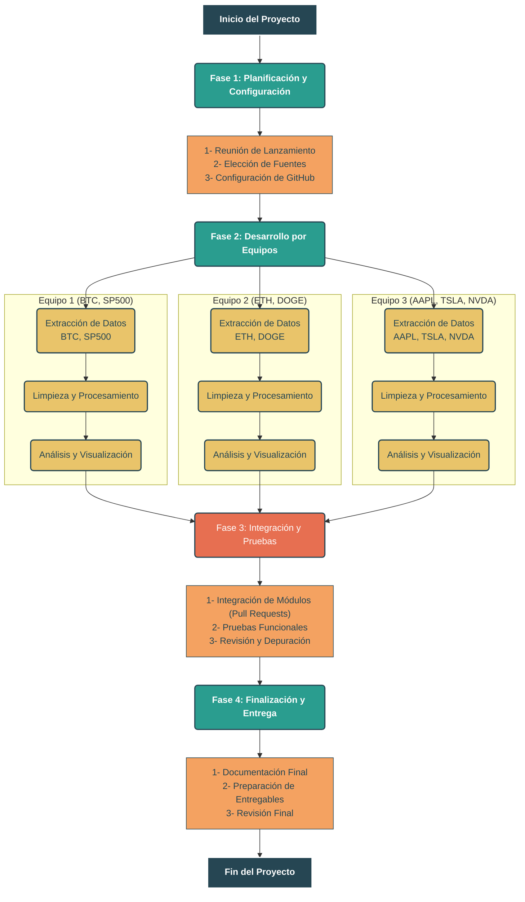

# Trabajo-Encargado-LP2
Repositorio del Trabajo Encargado LP2 con Chalán

# Análisis Cuantitativo de Riesgo y Rendimiento en Mercados Modernos

> Un estudio comparativo de Criptomonedas y Acciones del sector tecnológico para responder a una pregunta fundamental: ¿dónde habría sido mejor invertir?

---

### 📖 Introducción
En el dinámico panorama financiero del siglo XXI, la línea entre los mercados tradicionales y los nuevos activos digitales se vuelve cada vez más difusa. Por un lado, tenemos a los gigantes tecnológicos, empresas consolidadas cuyo valor en bolsa ha definido una era. Por otro, emerge con fuerza el ecosistema de las criptomonedas, un universo volátil, disruptivo y lleno de oportunidades.

Este proyecto nace de la intersección de estos dos mundos. Utilizando Python y herramientas de ciencia de datos, nos embarcamos en una misión para transformar el ruido del mercado en señales claras. No buscamos predecir el futuro, sino entender el pasado reciente de una manera cuantitativa y objetiva. A través del análisis de datos históricos, buscamos desentrañar las verdaderas personalidades de estos activos: su rendimiento, su riesgo inherente y las conexiones ocultas que los unen.

Este no es solo un trabajo de programación; es la simulación del trabajo de un analista de datos moderno, aplicando un enfoque estadístico para arrojar luz sobre uno de los debates financieros más relevantes de nuestro tiempo, y consolidando los conocimientos adquiridos en los cursos de Lenguaje de Programación I y II.

## 🎯 Objetivos del Proyecto
Para llevar a cabo nuestro análisis, hemos definido cuatro objetivos clave que estructuran nuestro flujo de trabajo de principio a fin:

#### Extracción y Centralización de Datos 🛰️
- Implementar un pipeline de datos robusto para conectarse a APIs públicas y obtener el historial de precios de un conjunto diverso de activos, incluyendo criptomonedas y acciones tecnológicas.
- Centralizar la información extraída en un formato crudo y estandarizado, asegurando la replicabilidad de nuestro estudio.

#### Procesamiento y Limpieza de Datos 🧹
- Transformar los datos JSON crudos en DataFrames de `pandas` limpios, estructurados y listos para el análisis.
- Realizar un proceso de validación de datos que incluye la corrección de tipos de datos, el manejo de posibles valores nulos y la estandarización de las series de tiempo.

#### Análisis Comparativo Cuantitativo 📊
- **Análisis de Rendimiento:** Normalizar los precios de todos los activos para comparar de forma justa su crecimiento porcentual en el último año.
- **Análisis de Riesgo:** Calcular y comparar la volatilidad de cada activo como un indicador numérico de su riesgo.
- **Análisis de Correlación:** Generar una matriz de correlación para descubrir y cuantificar las relaciones entre los diferentes activos.

#### Visualización de Hallazgos 📈
- Diseñar y generar visualizaciones de alto impacto que comuniquen nuestros hallazgos de manera clara y efectiva.
- Crear un conjunto de gráficos (líneas, barras y un mapa de calor) que cuenten la historia completa del rendimiento, el riesgo y las interconexiones de los mercados analizados.

## 🏗️ Metodología y Arquitectura del Proyecto
Este proyecto fue concebido no como un simple script, sino como un sistema modular que sigue las mejores prácticas de la ingeniería de software y la ciencia de datos.

### Pipeline de Datos (ETL)
La arquitectura del proyecto sigue un modelo de **Pipeline de Datos (Extracción, Transformación y Carga)**, donde cada fase es independiente pero está conectada con la siguiente:
1.  **Extracción (E):** Módulos dedicados a la comunicación con las APIs. Se evaluó el uso de Web Scraping, pero se optó por APIs debido a su fiabilidad y la entrega de datos estructurados (JSON), reduciendo la complejidad en la fase de limpieza.
2.  **Transformación (T):** Módulos de procesamiento que toman los datos crudos y, aplicando los principios de la Programación Orientada a Objetos (POO), los encapsulan y transforman en DataFrames limpios y estandarizados.
3.  **Carga (L):** En este caso, la "carga" se realiza al generar los productos finales: los archivos de visualización (`.png`) y las tablas de resultados en el reporte.



### Análisis Estadístico
El núcleo del proyecto se basa en la aplicación de conceptos estadísticos para extraer insights de los datos:
- **Estadística Descriptiva:** Se utilizan medidas de tendencia central y dispersión para obtener un resumen inicial de cada activo.
- **Análisis de Volatilidad:** Se calcula la desviación estándar de los retornos logarítmicos diarios como un proxy cuantitativo del riesgo de cada activo.
- **Análisis de Correlación:** Se utiliza el coeficiente de correlación de Pearson para construir una matriz que mide la dirección y la fuerza de la relación lineal entre los pares de activos.

### Entorno de Desarrollo y Colaboración
- **Prototipado en Jupyter Notebook:** La exploración inicial de datos (EDA), las pruebas de conexión a las APIs y el diseño de las visualizaciones se realizaron en un entorno de Jupyter Notebook por su flexibilidad e interactividad.
- **Modularización a Scripts (`.py`):** Una vez validada la lógica, el código fue refactorizado y modularizado en scripts de Python para crear un pipeline ejecutable y mantenible.
- **Control de Versiones (Git y GitHub):** Se implementó un flujo de trabajo basado en `feature branching`. Cada equipo de desarrollo trabajó en una rama aislada para su activo o funcionalidad. La integración del código a la rama `main` se gestionó exclusivamente a través de **Pull Requests (PRs)**, exigiendo la revisión de código por pares para garantizar la calidad y la colaboración efectiva.

## 🛠️ APIs y Librerías Utilizadas
### Fuentes de Datos:
- **CoinGecko API:** Elegida por su robustez y generoso plan gratuito para obtener datos históricos de todas las criptomonedas.
- **Alpha Vantage API / `yfinance`:** Seleccionadas para obtener datos históricos de las acciones de empresas y índices bursátiles, por su amplia cobertura y facilidad de uso.

### Librerías Principales:
- `requests`: Para la comunicación con las APIs.
- `pandas`: Para la manipulación, limpieza y análisis de datos.
- `numpy`: Para cálculos numéricos eficientes, especialmente en el análisis estadístico.
- `matplotlib` & `seaborn`: Para la creación de visualizaciones estáticas de alta calidad.
- `Jupyter`: Para el entorno de prototipado y exploración de datos.

## 🚀 Instrucciones de Uso
1.  Clonar el repositorio a su máquina local:
    ```bash
    git clone [https://github.com/Bryared/Trabajo-Encargado-LP2](https://github.com/Bryared/Trabajo-Encargado-LP2)
    ```
2.  Se recomienda crear un entorno virtual para aislar las dependencias del proyecto:
    ```bash
    python -m venv venv
    source venv/bin/activate  # En Windows: venv\Scripts\activate
    ```
3.  Instalar las dependencias necesarias desde el archivo de requerimientos:
    ```bash
    pip install -r requirements.txt
    ```
4.  Ejecutar el script principal para iniciar el pipeline completo de análisis:
    ```bash
    python main.py
    ```


# Integrantes
| Integrante | Código | Usuario |
|---|---|---|
| Vargas Maldonado, Bryan | 20230535 | Bryared |
| Vargas Maldonado, Andrew | 20240959 | andrwxl |
| Villanueva Huamani Alexander | 20230419 | alexvilla123 |
| Alva Aquino Nicole | 20221388 | ... |
| Ruiz Macedo Fernando Jose | 20211830 | ... |
| Ramos Correa, Freddy | 20230408 | 20230408 |
| Coronado de la vega, Alonso| 20221395 | ron-62 |
| Lopez Acuña Victor Andreé | 20180206 | VictorLopez281199 |
| Arroyo Arruz, Alejandra  | 20211805 | Alejandra-1805 |
| Nombre Alumno 10 | C010 |
| Nombre Alumno 11 | C011 |
