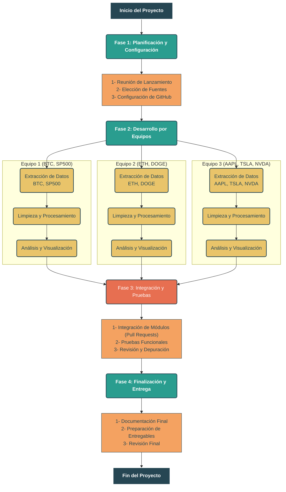

# Trabajo-Encargado-LP2
Repositorio del Trabajo Encargado LP2 con Chalán

# Título del Proyecto

## 🎯 Objetivo
Este proyecto busca analizar ...

## 🛠️ APIs Utilizadas
* API1
* API2

## 🚀 Instrucciones de Uso
1.  Clonar el repositorio.
2.  Instalar las dependencias: `pip install -r requirements.txt`
3.  Ejecutar el script principal: `python main.py`

## 📊 Visualizaciones
*Aquí se insertarán los gráficos y tablas finales.*

# Integrantes
| Integrante | Código | Usuario |
|---|---|---|
| Vargas Maldonado, Bryan | 20230535 | Bryared |
| Vargas Maldonado, Andrew | 20240959 | andrwxl |
| Villanueva Huamani Alexander | 20230419 | ... |
| Alva Aquino Nicole | 20221388 | ... |
| Ruiz Macedo Fernando Jose | 20211830 | ... |
| Ramos Correa, Freddy | 20230408 | ... |
| Coronado de la vega, Alonso| 20221395 | ron-62 |
| Lopez Acuña Victor Andreé | 20180206 | VictorLopez281199 |
| Arroyo Arruz, Alejandra  | 20211805 | Alejandra-1805 |
| Nombre Alumno 10 | C010 |
| Nombre Alumno 11 | C011 |
